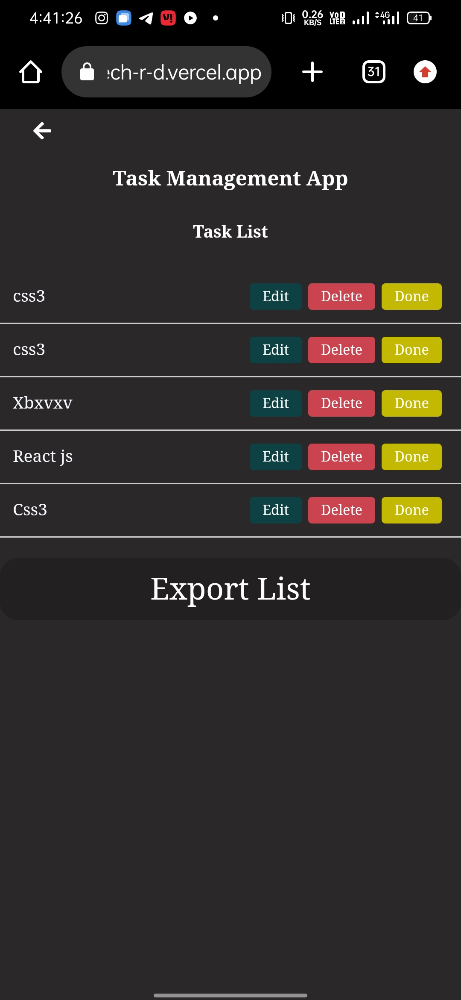
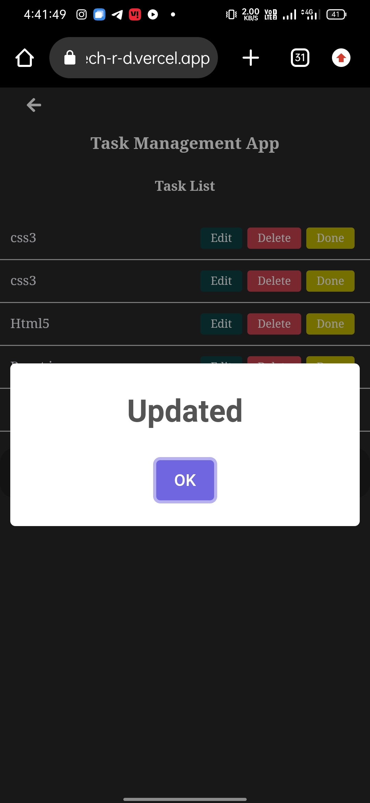
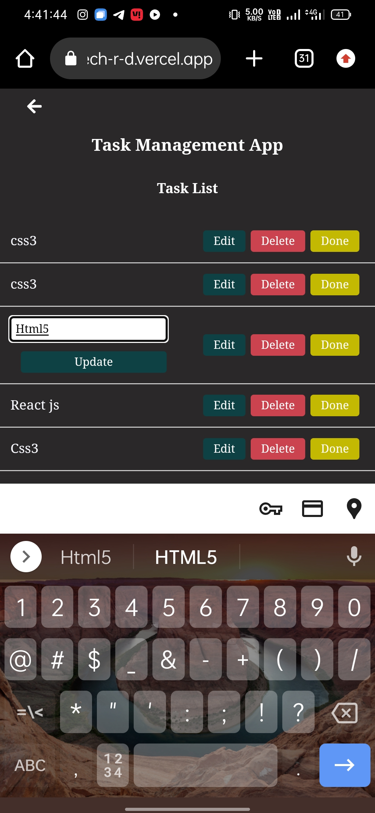

# Task Management React Web Application

## Overview
This is a simple task management web application built using React. It allows users to add, update, delete tasks, move tasks between lists, and export the entire list to Excel.

## Responsiveness

The Task Management App is designed to be responsive and user-friendly across various devices and screen sizes. The following considerations have been made:

- **Large Screens:**
  - The app provides an optimal experience on large screens, utilizing the available space efficiently.
  - The task list and other components are well-organized and easy to navigate.

- **Medium Screens:**
  - On medium-sized screens, such as tablets, the app adjusts its layout to maintain a user-friendly interface.
  - Tasks are displayed in a readable format, and users can seamlessly interact with the application.

- **Small Screens:**
  - The app is fully responsive on small screens, ensuring a smooth user experience on mobile devices.
  - Navigation elements are adapted for touch interactions, and the layout is optimized for smaller viewports.

This responsiveness ensures that users can access and manage their tasks seamlessly regardless of the device they are using.

## Functionalities

### 1. Add a Task
Users can add a task card to the list by entering the task details in the provided form.

### 2. Update/Delete Task
Users can update or delete a task card by using the respective buttons provided for each task.

### 3. Move the Card to Another List
Tasks can be moved to another list, for example, from the "Pending" list to the "Completed" list, by clicking the "Done" button.

### 4. Export the Entire List to Excel
Users can export the entire task list to an Excel file by clicking the "Export List" button.

## Getting Started

### Prerequisites
- Node.js and npm installed on your machine.

## Screenshots

## Live Demo

Check out the live demo of the Task Management App [here](https://vivatech-r-d.vercel.app/).

## Simple Solution Document

### Adding a Task
1. Open the application.
2. Navigate to the "Add Task" section.
3. Enter the task details in the input field.
4. Click the "Add Task" button.

### Updating a Task
1. Find the task you want to update in the task list.
2. Click the "Edit" button.
3. Modify the task details in the input field.
4. Click the "Update" button.

### Deleting a Task
1. Find the task you want to delete in the task list.
2. Click the "Delete" button.

### Moving a Task to Another List
1. Find the task you want to move in the task list.
2. Click the "Done" button to move it to the completed list.

### Exporting the Entire List to Excel
1. Click the "Export List" button.
2. An Excel file containing the task list will be downloaded.

---